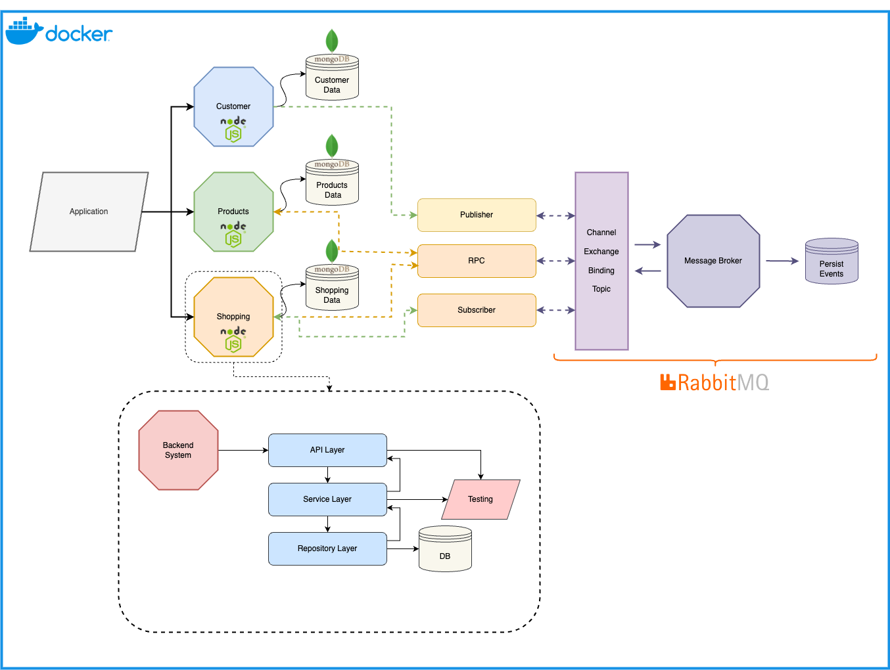

# Microservices - Shopping App

This project is an application developed using Node.js and based on a microservices architecture. It is configured to run in Docker containers. Additionally, MongoDB is used as the database, and RabbitMQ is used as the message broker. Nginx is configured as a reverse proxy for distribution.

## Microservices and Microservices Architecture

Microservices architecture is an architectural approach that divides a software application into independent services. Each service handles a single functionality and communicates with other services. This makes the application more modular, scalable, and easier to maintain. Microservices also allow for independent changes to technology stacks and development teams.

## Message Broker and RabbitMQ

A message broker is a tool that facilitates communication between different systems. A message broker like RabbitMQ manages asynchronous messaging between microservices. This reduces the dependencies between components in the system and makes communication between services more flexible.

## Project Structure

This project consists of three main microservices:

-   Customer Service: Manages operations related to customers, creates and verifies user registration.
-   Product Service: Manages operations related to products, allows for the creation and listing of products.
-   Shopping Service: Manages shopping transactions, creates shopping carts for users, and processes orders.

Each service uses the following NPM packages:

-   amqplib
-   bcrypt
-   bcryptjs
-   cors
-   dotenv
-   express
-   jsonwebtoken
-   mongoose
-   uuid
-   winston
-   @sentry/node
-   @sentry/profiling-node

## Running Steps

-   Clone the project to your local machine.
-   Create your own environment file using the command `cp .env.example .env`. If you do not want to use Sentry, comment out the following line in the `src/index.js` file of each service: `setupSentryCapture(app);`.
-   To have product data in the DB when Docker first starts, run the command `chmod +x mongo-seed/import.sh` initially. This step is necessary for loading data into the database when Docker starts up.
-   To run the project in a Docker environment, use the command `docker-compose up` or `docker compose up -d`.
-   Alternatively, you can use the `npm start` command for each service to start them separately.

## Nginx Configuration

Nginx is used as the distribution server in this project. The Nginx configuration for the project is provided in the `nginx.conf` file. This configuration directs incoming requests to the appropriate services and performs load balancing.
