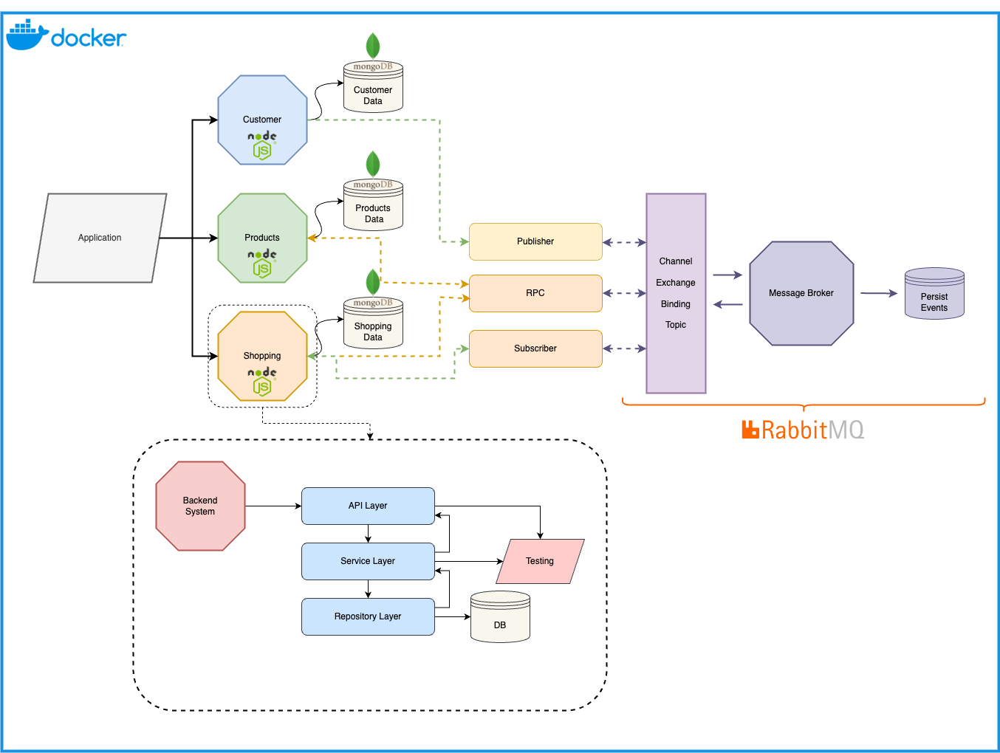

# Microservices - Shopping App

Bu proje, Node.js kullanılarak geliştirilmiş ve mikroservis mimarisine dayalı bir uygulamadır. Projede, Docker konteynerlerinde çalışacak şekilde yapılandırılmıştır.
Ayrıca, veritabanı olarak MongoDB ve mesaj sıralayıcısı olarak RabbitMQ kullanılmıştır. Nginx, dağıtım için bir ters proxy olarak yapılandırılmıştır.

## Mikroservis ve Mikroservis Mimarisi

Mikroservis mimarisi, bir yazılım uygulamasını bağımsız servislere bölen bir mimari yaklaşımdır. Her servis, tek bir işlevselliği ele alır ve diğer servislerle iletişim kurar. 
Bu, uygulamanın daha modüler, ölçeklenebilir ve bakımı daha kolay hale gelmesini sağlar. Mikroservisler aynı zamanda teknoloji yığınlarının ve geliştirme takımlarının bağımsız olarak değiştirilmesine olanak tanır.

## Mesaj Sıralayıcısı (Message Broker) ve RabbitMQ

Mesaj sıralayıcısı, farklı sistemler arasında iletişimi kolaylaştıran bir araçtır. RabbitMQ gibi bir mesaj sıralayıcısı, mikro servisler arasında asenkron mesajlaşmayı yönetir. 
Bu, sistemdeki bileşenlerin daha az bağımlı olmasını sağlar ve servisler arasındaki iletişimi esnek hale getirir.

## Proje Yapısı

Bu proje, üç ana mikroservisten oluşmaktadır:

- Customer Service (Müşteri Servisi): Müşterilerle ilgili işlemleri yönetir, kullanıcıların kaydını oluşturur ve doğrular.
- Product Service (Ürün Servisi): Ürünlerle ilgili işlemleri yönetir, ürünlerin oluşturulmasını ve listelenmesini sağlar.
- Shopping Service (Alışveriş Servisi): Alışveriş işlemlerini yönetir, kullanıcıların alışveriş sepetlerini oluşturur ve siparişlerini işler.

Her servis, aşağıdaki NPM paketlerini kullanmaktadır:

- amqplib
- bcrypt
- bcryptjs
- cors
- dotenv
- express
- jsonwebtoken
- mongoose
- uuid
- winston
- @sentry/node
- @sentry/profiling-node

## Çalıştırma Adımları

- Projeyi yerel makinenize klonlayın.
- cp .env.example .env komutu ile kendi env dosyanızı oluşturun. Eğer sentry kullanmak istemiyorsanız; her servis'in `src/index.js` dosyasında şu satırı yoruma alın `setupSentryCapture(app);`.
- Docker ilk ayağa kalktığında DB içerisinde product verileri olması için, ilk etapta `chmod +x mongo-seed/import.sh` komutunu çalıştırın. Bu aşama docker ayağa kalkarken verilerin db'ye yüklenmesi için gerekli.
- Docker ortamında projeyi çalıştırmak için `docker-compose up` veya `docker compose up -d` komutunu kullanın.
- Alternatif olarak, her servisi ayrı ayrı başlatmak için npm start komutunu her bir servis için kullanabilirsiniz.

## Nginx Konfigürasyonu

Nginx, bu projede dağıtım sunucusu olarak kullanılmaktadır. Projenin Nginx konfigürasyonu, nginx.conf dosyasında sağlanmıştır. Bu konfigürasyon, gelen istekleri doğru servislere yönlendirir ve yük dengelemesi yapar.

